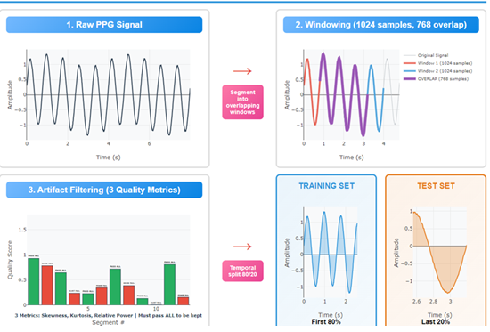
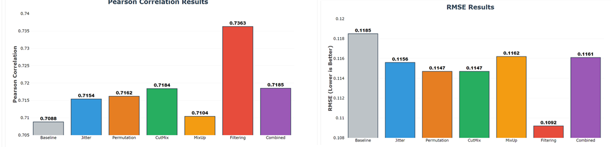

# ECG Reconstruction from PPG Using W-Net

## Introduction

This project replicates Tang et al.'s W-Net model for reconstructing ECG from PPG on a different dataset. Additionally, we explored **data augmentation strategies** and **artifact filtering** to improve model performance.

**Motivation:** ECG is a critical diagnostic tool but often inaccessible. PPG is widely available (e.g., smartwatches) and correlates well with ECG. Reconstructing ECG from PPG combines accessibility with diagnostic value.

## Methods

### Preprocessing:
- Segment recordings into 1024-sample windows with consecutive segments starting 256 samples apart
- **Artifact Filtering (my addition):** Each segment is evaluated using skewness, kurtosis, and relative power in target frequency bands (PPG: 1–10 Hz, ECG: 5–15 Hz). Segments outside acceptable ranges are discarded to ensure high-quality inputs.
- Train/test split: first 80% for training, last 20% for testing to prevent leakage.

### Model Architecture:
W-Net (dual U-Net) for reconstructing complex signals (original work by Tang et al.).

### Loss Function:
Weighted combination of MAE, MSE, and 1−Pearson correlation to balance point-wise accuracy and waveform similarity.

## Data Augmentation (my additions)

- **Jittering:** Adds Gaussian noise to simulate physiological variability.
- **Permutation:** Shuffles segments to emphasize local patterns.
- **CutMix:** Swaps contiguous chunks between signal pairs, encouraging generalization while preserving realistic waveforms.
- **MixUp:** Weighted blending of signal pairs; less stable.
- **Cropping + Warping:** Temporal distortions; often degraded performance.

## Results

| **Augmentation / Setup** | **Pearson** | **RMSE** | **Notes** |
|---------------------------|-------------|----------|-----------|
| Baseline (no augmentation) | 0.7088 | 0.1185 | Tang et al. model |
| Jitter (std=0.01) | 0.7154 | 0.1156 | Robust to noise |
| Permutation (4 segments) | 0.7162 | 0.1147 | Emphasizes local features |
| CutMix (α=0.2) | 0.7184 | 0.1147 | Stable, preserves realistic chunks |
| MixUp (α=0.4) | 0.7104 | 0.1162 | Moderate improvement, unstable at lower α |
| Multiple methods | 0.7185 | 0.1161 | No improvement vs individual methods |
| Cropping + Warping | ↓ | ↑ | Temporal distortion harms signals |
| Baseline + Artifact Filtering | 0.7363 | 0.1092 | Filtering removed noisy segments |

## Conclusion

- Augmentations (Jittering, Permutation, CutMix) modestly improved performance; MixUp and Cropping/Warping were inconsistent.
- Artifact filtering had the largest impact, confirming that **data quality**, not quantity, limits performance.
- CutMix and Permutation succeed because they preserve realistic signal structures; unstable MixUp and warping distort signals.
- Tang et al. reported higher performance on a different dataset, reflecting dataset differences.
- Transfer learning with a biosignal foundation model could further improve results, but no such pretrained model exists.
